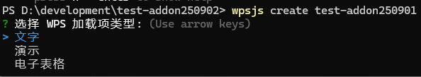
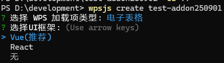
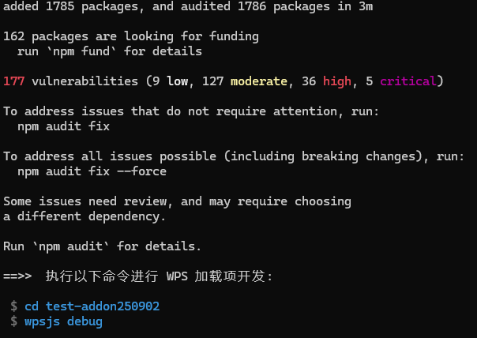
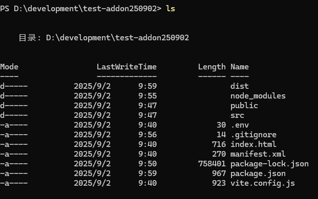
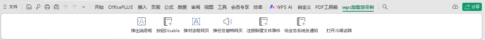
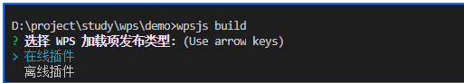
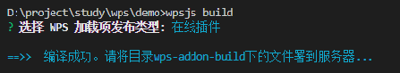
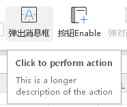
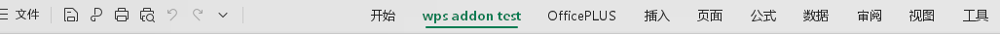
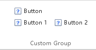

# WPS addon 
- @auther: John Fu 
- @Date: 2025/9/2

## Prerequisite
- node version 24.7.0
- WPS
- Visual Studio Code
- wpsjs

If you have any problem with wpsjs. There is a [document](https://www.kdocs.cn/l/cASCu9B0G) in Chinese explain the command of what WPS has or there is an **official QQ chat group `185170323`** to contact for asking further assitance.


### Install wpsjs
Install wpsjs globally if admin priviliage is granted.
If this is a fresh install then run the command:
```bash
npm install -g wpsjs
```
Otherwise, you could choose to update the wpsjs by running the command:
```bash
npm update -g wpsjs
```

## Initialization
Once the wpsjs is installed, you will be able to initialize an addon project, go to your desired dev directory, replace `$project` variable with your real project name.
```bash
cd .\dev\$project
```
and create the project by running, in case you have multiple, you could use another variable `$version`
```bash
wpsjs create addon-$version
```
And you should see something like below right away:



There are three options listed here that specifies different type of addon targets:
```bash
Choose WPS addon type:
> word
  powerpoint
  excel
```

Choose the one that is required. In this document, the `excel` was chosen.

Once the `excel` was chosen. You should be able to see below:



It is translated into below
```bash
? Choose WPS addon type: excel
? Choose UI framework:
> Vue(recommanded)
  React
  None
```

Choose the `React` and wait the wpsjs to install the dependencies for the development. Ignore the warinings during the installation for now. 

If the installation was completed successfully, you would see the guide for you to start the project like below.



Now, check your directory using `ls`, you would see a vite based javascript project was created under your chosen folder.



If you can see the listed files above. That means your installation has completed successfully. Now you could try run the command:
```bash
wpsjs debug
```

to start the development.

### Debug
```bash
D:\development\test-addon250902> wpsjs debug
> test-addon250902@1.0.0 dev
> vite --port 3889

The CJS build of Vite's Node API is deprecated. See https://vite.dev/guide/troubleshooting.html#vite-cjs-node-api-deprecated for more details.

  VITE v5.4.19  ready in 463 ms

  ➜  Local:   http://localhost:3889/
  ➜  Network: http://172.28.144.1:3889/
  ➜  Network: http://192.168.0.106:3889/
  ➜  press h + enter to show help

```

Once you ran the command ```wpsjs debug```. The addon project will start with default port 3889. A WPS table draft file will be started alongside. 

On the WPS table file that just be started. You will find the entrance button `wps加载项示例` for the addon project on menu bar to the far right end. Click on the `wps加载项示例`, you would see serval buttons were created already for quick customization like below.



It is also show you the basic interaction and help you to understand how the code and UI are incoorperated.

## Deploy
There are two ways to deploy the addon.
- jsplugins.xml
- publish.xml (recommanded by wpsjs)

The following will introduce these two ways in practical.

### Build

In case of needs to deploy addon with **jsplugin.xml** mode. The wpsjs has command ```wpsjs build``` where you can run under the directory of your addon project. There are also offical [document](https://365.kdocs.cn/l/cBk8tsBIf) in Chinese for further information.

Once you ran ```wpsjs build``` you would see below:



```bash
Choose WPS addon publish type:
> online addon
  offline addon
```

#### 1. Online addon mode
The online mode is the code deploying on the server. The addon will then fetch the addon every time that needed.

Choose ```online addon``` and you would see:


```bash
Choose WPS addon publish type: online addon

==>> complied successfully. Please copy the files in directory wps-addon-build to your server.
```

Once you got the wps-addon-build files into your online server, for example `http://127.0.0.1:3888/`. You need to make changes to your **jsplugin.xml** configuration like below:
```xml
<!-- WPS addon: online mode configuratioin  start -->
<jsplugins>
  <jspluginonline name="EtOAAssist" type="et" url="http://127.0.0.1:3888/plugin/et" />
  <jspluginonline name="WpsOAAssist" type="wps" url="http://127.0.0.1:3888/plugin/wps" />
  <jspluginonline name="WppAAssist" type="wpp" url="http://127.0.0.1:3888/plugin/wpp" />
</jsplugins>
<!-- WPS addon: online mode configuratioin  end -->
```
- `name`: addon name 
- `type`: addon type
  - `et`: wps table (excel)
  - `wps`: wps word (word)
  - `wpp`: wps presentation (powerpoint)
- `url`: the server address, ensure the `ribbon.xml` and `index.html` in the location can both be accessed.

After you save the jsplugins configuration. You could try visit http://127.0.0.1:3888/plugin/et/ribbon.xml and http://127.0.0.1:3888/plugin/et/index.html to verify the deployment. Remember to change the address with your real domain.

Pros: The addon code will remain the latest. \
Crons: Relies on the internet connection to have a smooth access experience. The initilization would take longer as it needs to communicate with the server.

#### 2. Offline addon mode
The offline mode is to use the downloaded distribution of the code and get it run locally. And there are two types for offline mode: with internet connection and without internet connection.

***Offline mode with internet connection***

```xml
<!-- WPS addon: offline mode configuratioin  start -->
<jsplugins>
  <jsplugin name="EtOAAssist" type="et" url="http://127.0.0.1:3888/plugin/v0.1/EtOAAssist.7z" version="0.1" />
  <jsplugin name="WpsOAAssist" type="wps" url="http://127.0.0.1:3888/plugin/v0.1/WpsOAAssist.7z" version="0.1" />
  <jsplugin name="WppAAssist" type="wpp" url="http://127.0.0.1:3888/plugin/v0.1/WppAAssist.7z" version="0.1" />
</jsplugins>
<!-- WPS addon: offline mode configuratioin  end -->
```
- `name`: addon name 
- `type`: addon type 
  - `et`: wps table (excel)
  - `wps`: wps word (word)
  - `wpp`: wps presentation (powerpoint)
- `url`: the server address to download the package, ensure the packages are ended with `7z` and to be able to downloaded via browser.
- `version`: The version is part of the decision that making the jsaddons to determine whether the newer package is available. Specifically, when loaded, the jsaddons will check the current directory for `name+_+version` combination. If already exists, the current package will be loaded, or it will make a request to download the newer version till it matches the combination.

Pros: The addon will only be downloaded whenever the name and version does not match.
Crons: The entire package will be downloaded as it would cause longer time to initialized. It is not recommended if the version/code changes frequently.

***Offline mode without internet connection***
1. Configure the `oem.ini` (jsplugins.xml mode) or `publish.xml` (publish mode).
2. Get the distribution package ready.
3. Copy the files into jsaddons/ folder. For windows, it locates normally `%appdata%` under the `kindsoft\wps\jsaddons`, or Linux `~/.local/share/Kingsoft/wps/jsaddons`

### Publish
The ```wps publish``` is a way to release the addon online and to distribute to the public. Before running the command, please ensure that the `package.json` has the `addonType` attribute like below: 
```json
{
	"name": "test-addon250902",
	"addonType": "et", // <-- only wps, et and wpp are allowed.
	"version": "1.0.0",
  // ...
}
```

Run the command and provide the variables respectively step by step.
```bash
D:\development\test-addon250902> wpsjs publish
服务器地址示例 "http://127.0.0.1/jsplugindir/"
# server address example "http://127.0.0.1/jsplugindir/"
? 请输入发布 WPS 加载项的服务器地址:
# ? Please enter the WPS addon publish server address
```

```bash
D:\development\test-addon250902> wpsjs publish
服务器地址示例 "http://127.0.0.1/jsplugindir/"
# server address example "http://127.0.0.1/jsplugindir/"
? 请输入发布 WPS 加载项的服务器地址: http://127.0.0.1/jsplugindir/
# ? Please enter the WPS addon publish server address: http://127.0.0.1/jsplugindir/
? 选择 WPS 加载项发布类型:
# ? Please choose WPS addon publish mode:
> 在线模式 # online mode
  离线模式 # offline mode
```

At the end you would see the output looks like below:
```bash
D:\development\test-addon250902> wpsjs publish
服务器地址示例 "http://127.0.0.1/jsplugindir/"
# server address example "http://127.0.0.1/jsplugindir/"
? 请输入发布 WPS 加载项的服务器地址: http://127.0.0.1/jsplugindir/
# ? Please enter the WPS addon publish server address: http://127.0.0.1/jsplugindir/
? 选择 WPS 加载项发布类型: 在线模式
# ? Please choose WPS addon publish mode: online mode
? 您的publish页面是否需要满足多用户同时使用: 否
# Your publish page needs to be visited by multiple users concurrently: no

> test-addon250902@1.0.0 build
> vite build

The CJS build of Vite's Node API is deprecated. See https://vite.dev/guide/troubleshooting.html#vite-cjs-node-api-deprecated for more details.
vite v5.4.19 building for production...
✓ 145 modules transformed.
dist/index.html                      0.82 kB │ gzip:  0.47 kB
dist/assets/index-DRus5q8k.css       0.20 kB │ gzip:  0.16 kB
dist/assets/functions-BmXlO6VN.js    0.20 kB │ gzip:  0.21 kB
dist/assets/index-CF6ejpme.js      257.69 kB │ gzip: 80.39 kB
✓ built in 1.72s

==>>  1.生成发布文件成功。请确保将目录D:\development\test-addon250902\wps-addon-build下的文件部署到http://127.0.0.1/jsplugindir/


        请用浏览器访问http://127.0.0.1/jsplugindir/ribbon.xml来验证部署是否成功，成功打开后是以'<customUI...'开头的文本

==>>  2.请将D:\development\test-addon250902\wps-addon-publish\publish.html分发给使用者，强烈建议同样将其部署到服务器...
```

Once you see the output above. You would be able to see two new folders created.
```bash
D:\development\test-addon250902> ls | findstr "wps"
d-----          2025/9/2     15:07                wps-addon-build
d-----          2025/9/2     15:07                wps-addon-publish
```

In `wps-addon-build` you should see:
```bash
D:\development\test-addon250902> ls wps-addon-build

Mode                 LastWriteTime         Length Name
----                 -------------         ------ ----
d-----          2025/9/2     15:07                assets
d-----          2025/9/2     15:07                images
-a----          2025/9/2      9:40           3150 favicon.ico
-a----          2025/9/2     15:07            776 functions.json
-a----          2025/9/2     15:07            816 index.html
-a----          2025/9/2      9:40            270 manifest.xml
-a----          2025/9/2     13:41           2800 ribbon.xml
```
Copy all these files into the server that you provided earlier in this section. In this case, the `http://127.0.0.1/jsplugindir/` was provided. And verify the http://127.0.0.1/jsplugindir/ribbon.xml to see if the page could open and starts with `<customUI...`

In `wps-addon-publish` you should see:
```bash
D:\development\test-addon250902> ls wps-addon-publish

Mode                 LastWriteTime         Length Name
----                 -------------         ------ ----
-a----          2025/9/2     15:07          45757 publish.html
```
The `publish.html` then will need to be distributed to the users offline or online. If they open locally or open it with the url you provided on the server, for example http://127.0.0.1/publish.html, they would see:


The publishes will be accumulated. So if you have multiple packages need to be released. Only the last publish need to be deployed. 

If you want to remove one of the previous publish. You could done that by running ```wpsjs unpublish``` under the coresponding addon folder.
## Development

### ribbon.xml
The `ribbon.xml` is the configuration file for the ribbon UI in the WPS add-in. It defines the structure and behavior of the ribbon, including tabs, groups, and controls (buttons, edit boxes, etc.). This file is essential for customizing the user interface and providing a seamless experience for users. 

During the development, to make any changes effective, you need to reload the add-in or refresh the ribbon UI.

It follows the [[Office UI XML schema 2006]](https://learn.microsoft.com/en-us/openspecs/office_standards/ms-customui/5f3e35d6-70d6-47ee-9e11-f5499559f93a). You can also check the [[Custom UI Offical Document]](https://learn.microsoft.com/en-us/openspecs/office_standards/ms-customui/edc80b05-9169-4ff7-95ee-03af067f35b1) for overall guide. There are five main types of modules, and each depends on the others in a hierarchical manner. They are **Attribute types**, **Attribute**, **Controls**, **Containers**, and **Root elements**.

#### Attribute types
Defines the atomic data types of UI components. All attribute values ​​are based on these types to ensure data legitimacy.
|Name|Type|Value|Description|
|----------------|----|-----|-----------|
|ST_QID	|xsd:QName	| 1-1024 characters	|Qualified ID (used when sharing controls across plugins, such as `idQ`)|
|ST_ID	|xsd:NCName	| 1-1024 characters	|Custom control ID (such as `id`) or built-in control ID (such as `idMso`, usage of built-in control IDs can be found in the [[ribboncreator2010.de - Excel]](https://www.ribboncreator2010.de/Onlinehelp/EN/_2hm0n7htf.htm) or [[ribboncreator2010.de - Word]](https://www.ribboncreator2010.de/Onlinehelp/EN/_2hm0n9inj.htm))|
|ST_UniqueID	|xsd:ID	| 1-1024 characters, unique	|Globally unique control ID (such as id)|
|ST_Delegate	|xsd:string	| 1-1024 characters	|Callback function name (such as `onAction`, `getEnabled`, associated with ribbon.js functions)|
|ST_Size	|enum (xsd:string)	| only `normal`/`large`	|Button/menu size (such as large button, small button)|
|ST_BoxStyle	|enum (xsd:string)	| only `horizontal`/`vertical`	|Box container layout direction (horizontal/vertical grouping controls)|
|ST_Keytip	|xsd:token	|1-3 letters/digits, no spaces	|Shortcut key tip (such as press Alt+MT to open the custom tab)|
|ST_String	|xsd:string	|1-1024 characters	|Plain text (such as control label, tooltip)|
|ST_LongString	|xsd:string	|1-4096 characters	|Long text (such as control extended description)|

#### Attribute
Packaging commonly used attributes into attribute groups (`xsd:attributeGroup`) to avoid repeated definitions is the "attribute template" of controls/containers.


**ID Related** 
|Name|Value|Description|Rules|
|----|-----|-----------|-----|
|AG_IDCustom|	`id` (ST_UniqueID), `idQ` (ST_QID)|	Custom control ID	|Choose one of the two (`id` is globally unique, `idQ` is used to share across plugins)|
|AG_IDMso|	`idMso` (ST_ID)|	Reference Office built-in controls	|For example, `idMso="FileSave"` references the "Save" button|
|AG_IDAttributes|	Combination of AG_IDCustom + AG_IDMso + AG_Tag|	Unified control ID configuration	|Must select one ID type (`id`/`idMso`/`idQ`)|

Example:
```xml
<button id="customButton"/>
```

**UI Related** 
|Name|Value|Description|Rules|
|----|-----|-----------|-----|
|AG_Enabled|	`enabled` (boolean), `getEnabled`（ST_Delegate）|	Whether the control is enabled	|Choose one of the two (use `enabled` for static configuration, use `getEnabled` callback for dynamic)|
|AG_Visible|	`visible` (boolean), `getVisible`（ST_Delegate）|	Whether the control is visible	|Same logic as AG_Enabled|
|AG_Image|	`image` (path), `imageMso` (built-in image, the list of values could be referred from [[Bert Toolkit (with icon preview)]](https://bert-toolkit.com/imagemso-list.html) or [[Microsoft document]](https://learn.microsoft.com/en-us/openspecs/office_standards/ms-customui/fe2124a1-5aaa-4adf-b285-5d58da9d5e2a)), `getImage` (callback)|	Control image	|Choose one of the three (use `image` for custom image, use `imageMso` for built-in image)|
|AG_Screentip|	`screentip` (short tip), `supertip` (long tip) + corresponding callback|	Mouse hover tip	|For example, ```supertip="Click to save the current document"```|

Example:
```xml
<button 
  id="customButton"
  visible="true"
  enabled="true"
  image="customImage.png"
/>
```
or using ST_Delegate to make a dynamic callback
```xml
<button 
  id="customButton"
  getEnabled="ribbon.OnGetEnabled"
  getImage="ribbon.GetImage"
  getVisible="ribbon.OnGetVisible"
/>
```
define the coresponding functions in `components/ribbon.js`.
```javascript
function OnGetEnabled(control) {
  // Custom logic to determine if the control is enabled
  return true;
}

function GetImage(control) {
  // Custom logic to get the control image
  return "customImage.png";
}

function OnGetVisible(control) {
  // Custom logic to determine if the control is visible
  return true;
}
```
or when you have one function but want to handle multiple controls:
```javascript
function OnGetEnabled(control) {
  const controlID = control.id;
  switch (controlID) {
    case "btn1":
      // Custom logic to determine if the custom button is enabled
      return true;
    case "btn2":
      // Custom logic to determine if the second button is enabled
      return false;
    default:
      return false;
  }
  return true;
}
```
When dealing with Tooltips:
```xml
<button 
  id="customButton"
  screentip="Click to perform action"
  supertip="This is a longer description of the action"
/>
```
This example would look like



**Layout & Interaction**
|Name|Value|Description|Rules|
|----|-----|-----------|-----|
|AG_PositionAttributes|	`insertAfterMso`/`insertBeforeMso`/`insertAfterQ`/`insertBeforeQ`| Control insertion position| Select one of four options (e.g., `insertAfterMso="HomeTab"` inserts after the Home tab).|
|AG_Action|	`onAction` (ST_Delegate)| User action callback| such as `onAction="ButtonClick"` triggered by a button click (associated with a ribbon.js function).|
|AG_DropDownAttributes|	`getItemCount`/`getItemLabel`/`sizeString`, etc. see [[Dropdown]](https://learn.microsoft.com/en-us/openspecs/office_standards/ms-customui/700e4451-8706-40c5-8d7b-896e4ae21b69)| Drop-down controls (combo boxes, galleries) |use this to dynamically load drop-down items (e.g., getItemCount returns the number of items in the drop-down).|

Example:

The `insertAfterMso` controls the position of the tab in the ribbon. The `wpsAddinTab` will come right after the (`开始`) Home tab in the example below.



```xml
<tabs>
  <tab id="wpsAddinTab" label="wps addon test" insertAfterMso="TabHome">
</tabs>
```

The `onAction` binds the button click action to the function defined in `ribbon.js`.
```xml
<button
  id="customButton"
  onAction="ribbon.OnAction"
/>
```

```javascript
var ribbon = {
  OnAction: function(control) {
    // Custom logic for button action
  }
}
```

Similiarly, if multiple buttons need to share the same action, you can define a single function and use `switch` to handle different controls.

```javascript
var ribbon = {
  OnAction: function(control) {
    switch (control.id) {
      case "btnShowMsg":
        // Show message box
        break;
      case "btnIsEnbable":
        // Check if enabled
        break;
      default:
        break;
    }
  }
}
```

#### Controls
Defines all controls that can be used in WPS UI, based on inheritance relationship extension (such as `CT_Button` inherits from `CT_ButtonRegular`)

|Name|	Parent Type|Description|Key Attributes/Child Elements|
|----|-----|-----------|-----|
|CT_Button|	CT_ButtonRegular|	Resizable buttons|	Inherit `AG_SizeAttributes` (`size="large"`), `onAction`|
|CT_ToggleButton|	CT_ToggleButtonRegular|	Toggle buttons (e.g., "Bold")|	Add `getPressed` callback (returns pressed state)|
|CT_CheckBox|	CT_ToggleButtonRegular|	Check boxes|	Disable image attribute (only show text and check state)|
|CT_EditBox|	CT_Control|	Text input boxes|	Add `maxLength` (maximum character count), `onChange` (content change callback)|
|CT_ComboBox|	CT_EditBox|	Drop-down combo boxes|	Contains `<item>` child elements (0-1000), `AG_DropDownAttributes`|
|CT_Gallery|	CT_GalleryRegular|	Gallery controls (e.g., "Styles" list)|	Add `columns` (number of columns), `itemWidth` (item width)|
|CT_Menu|	CT_MenuRegular|	Drop-down menus|	Contains button / checkbox and other child controls, `itemSize` (menu item size)|
|CT_SplitButton|	CT_SplitButtonRegular|	Split buttons (left click, right drop-down)|	Contains `<button>`, `<toggleButton>` and `<menu>` child elements|

Example:

A `button` with description.


```xml
<button 
    id="button" 
    label="Button" 
    imageMso="HappyFace"
    description="This is a verbose description that describes the function of this control in detail." 
/>
<!-- or getDescription="ribbon.GetDescription" -->
```
A `buttonGroup` specifies a grouping container that groups controls together visually. The child controls are laid out horizontally. 


```xml
 <buttonGroup id="buttonGroup">
   <button id="button1" imageMso="Bold" />
   <button id="button2" imageMso="Italic" />
   <button id="button3" imageMso="Underline" />
 </buttonGroup>
```

A `toggleButton` that can be toggled between the pressed and un-pressed states by the end-user.


```xml
<toggleButton id="toggleButton" label="Toggle Button" />
```

A `comboBox` that allows a user to input a text string or select one from a list.


```xml
<comboBox id="comboBox" label="Combo Box">
   <item id="item1" label="Item 1" />
   <item id="item2" label="Item 2" />
   <item id="item3" label="Item 3" />
 </comboBox>
```
A `menu`


```xml
 <menu id="menu" label="Menu" imageMso="HappyFace" >
   <button id="button1" label="Button 1" imageMso="FileSave" />
   <button id="button2" label="Button 2" imageMso="Bold" />
   <button id="button3" label="Button 3" imageMso="Undo" />
 </menu>
```
or with dynamic menu control


```xml
 <dynamicMenu id="dynamic" label="Dynamic Menu" getContent="ribbon.GetMenuContent" />
```

A `menu` with title


```xml
 <menu id="menu" label="Menu With Title" title="Title String">
   <button id="button" label="Button" />
 </menu>
```

A `splitButton` is composed of either a button or a toggle button, and a drop-down menu. The icon and label shown on the split button come from the button or toggleButton child element.


```xml
 <splitButton id="splitButton" size="large" >
  <button id="button" imageMso="HappyFace" label="Split Button" />
  <menu id="menu">
   <button id="button1" label="Button 1" />
   <button id="button2" label="Button 2" />
  </menu>
 </splitButton>
```

#### Containers
Used to organize *Controls* to form a UI hierarchy (such as "tab → group → control").

|Name|Description|Key Attributes/Child Elements|
|----|-----------|-----|
|CT_Group|	Groups of controls within tabs (such as the Font group on the Home tab)|	Contains controls/separators (`<separator>`), optional `<dialogBoxLauncher>` (dialog box launcher)|
|CT_Tab|	Ribbon tabs (such as Home, Insert) |	Contains `<group>` (0-100), `label` (tab name)|
|CT_Box|	Horizontal/Vertical grouping controls (e.g., arranging multiple buttons in a row)|	Contains any controls (0-1000), `boxStyle="horizontal"` (horizontal layout)|
|CT_Qat|	Quick Access Toolbar (top small toolbar)|	Contains `<sharedControls>` (shared across all documents) and `<documentControls>` (document-specific)|
|CT_ContextualTabs|	Contextual tabs (e.g., "Picture Format" when an image is selected)|	Contains `<tabSet>` (contextual tab group), `idMso` (associated built-in contextual scene)|

Example:



A `group` and `box` combination:
```xml
<group id="group" label="Custom Group">
    <button id="button" label="Button" imageMso="HappyFace" />
    <box id="box" boxStyle="horizontal">
      <button id="button1" label="Button 1" imageMso="HappyFace" />
      <button id="button2" label="Button 2" imageMso="HappyFace" />
    </box>
</group>
```

A `qat` (Quick Access Toolbar), did not work as expected in wps.


```xml
<ribbon>
    <qat>
        <documentControls>
            <control idMso="CalculateNow" />
            <control idMso="HyperlinkInsert" />
        </documentControls>
    </qat>
</ribbon>
```

#### Root elements
The entry of the custom UI XML file. All UI configurations are nested in the root element.

|Name|Complex Type|Description|Key Attributes/Child Elements|
|----|----|-----------|-----|
|`<customUI>`|	CT_CustomUI	|The root of the custom UI|Contains `<commands>` (control property override) and `<ribbon>` (ribbon configuration), onLoad (UI loading callback, passing IRibbonUI object)|
|`<menu>`|	CT_MenuRoot	|The root of the dynamic menu (returned by getContent callback)|	Contains menu controls (buttons / checkboxes, etc.), `title` (menu title)|
|`<commands>`|	CT_Commands	|Batch override built-in control properties|	Contains`<command>` (e.g., disable all "Print" buttons: ```<command idMso="Print" enabled="false"/>```)|

#### Key Rules: Avoiding Configuration Errors
Attribute Mutual Exclusivity: Attributes within some attribute groups cannot be used simultaneously. 
- AG_Image requires **only** one of `image`, `imageMso`, or `getImage`;
- AG_PositionAttributes requires **only** one of the four insertion position attributes.

Required Attributes: Some attributes/sub-elements must be configured. 
- The dynamic menu (`CT_DynamicMenu`) must have a `getContent` callback (AG_GetContentAttributes);
- The control referenced by `<customUI>` must have a unique ID (one of `id`, `idMso`, or `idQ`).

Inheritance Restrictions: Some controls prohibit attributes of their parent type. 
- The label control (`CT_LabelControl`) prohibits `image` (cannot display images) and `keytip` (no shortcut keys);
- The split button (`CT_SplitButton`) prohibits `label` (the label is inherited by the inner button).

### ribbon.js
For all the buttons on the menu bar, the `src/components/ribbon.js` implements all the interactions, the ribbon components has different lifecycles to control the specific actions in behind.

- `OnAddinLoad`:
This is for the addon environment initilization. It takes `ribbonUI` as input and passes it to the global `Application.ribbonUI`.
- `OnAction`: 
This is where we bind the action to the menu buttons. The `OnAction` takes `control` as input, which can be used to enumerate over the `control.Id` for different actions. The `Id` was defined in the ***public/ribbon.xml*** associates with the buttons.
- **Others**:
The ribbon component could also take the customized methods for events that need to be listened globally, or define the actions that need to be binded with the ribbon.xml which need to be shown on the menu bar.

### Custom functions

Refer to the [[Official Documentation]](https://open.wps.cn/documents/dynamic.html?link=/app-integration-dev/wps365/client/wpsoffice/wps-integration-mode/wps-addin-development/wps-addin-custome-function.html),
the custom function will be included in the `manifest.xml`, the `manifest.xml` was created alongside the initialization the project using `wpsjs create $project` or you can create mainly under root directory. A typical `manifest.xml` would look like below:
```xml
<?xml version="1.0" encoding="UTF-8"?>
<JsPlugin>
  <ApiVersion>1.0.0</ApiVersion>
  <Name>HelloEt</Name>
  <Dwscription>addon Description</Dwscription>
  <Functions>
    <Uri>/functions.json</Uri>
    <Namespace>HelloEt</Namespace>
  </Functions>
</JsPlugin>
```
The `manifest.xml` defines the `functions.json` location and the namespace. The `functions.json` is where the custom functions are defined. There is no need to create `functions.json` manually, as it will be generated automatically during the build process. The `vite` build tool will scan the `functions.js` and generate `functions.json` based on the defined functions. If `vite` was not used, then you have to register the function manually as below:
```js
// functions.js
if (wps.AddCustomFunction !== undefined) { // to adapt older version of wps
    wps.AddCustomFunction("HelloEt", "custom_function", custom_function)
}
```
The first argument of `wps.AddCustomFunction` is the namespace which can be found in the section of `<Name></Name>` of `manifest.xml`, the second argument is the function name, and the third argument is the function itself.

In order to make the generation properly, the `vite.config.js` should contains the following configuration:
```js
export default defineConfig({
  ...
  plugins: [
    copyFile({
      src: 'manifest.xml',
      dest: 'manifest.xml',
    }),
    functionsScanner({
      inputJsPath: 'src/js/functions.js', // this line defines the location of the functions.js input
      outputJsonPath: 'functions.json', // this line defines the format and location of the functions.json output
      namespace: 'HelloEt',
    }),
    react()
  ],
  ...
})
```

The `functions.js` is just a regular javascript file, and it is not necessarily javascript code, it could also be written in Typescript. As the loader was defined in `vite.config.js` as below:
```js
export default defineConfig({
  base:'./',
  esbuild: {
    loader: "tsx",
    include: /src\/.*\.[jt]sx?$/,
    exclude: [],
  },
  esbuildOptions: {
    loader: { ".js": "jsx", ".ts": "tsx" },
    plugins: [traitJsAsJsx()],
  },
  ...
})
```

Keep in mind that when working with `functions.js`, since it lack of the type description, you may need to add JSDoc comments manually to ensure proper type inference and documentation generation as below:
```js
/**
 * This is a custom test function
 * @customfunction
 * @param {string} arg0 - string
 * @param {number} arg1 - number
 * @param {boolean} arg2 - boolean
 * @returns {string} - return as a string
 */
function custom_test_function(arg0, arg1, arg2) {
    let argAndType = (arg) => `${arg}: ${typeof arg}`
    let argAndTypeList = [arg0, arg1, arg2].map(argAndType)
    let message = `This is a custom test function with input (${argAndTypeList.join(', ')})`
    console.log(message)
    return message
}
```

The `@customfunction` tag is essential as only with this notation can the function be recognized as a custom function by the system. 
