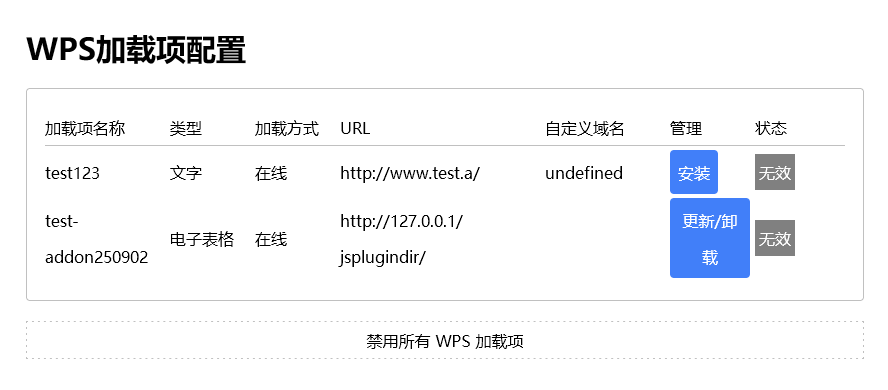

# WPS addon 
- @auther: John Fu 
- @Date: 2025/9/2

## Prerequisite
- node version 24.7.0
- WPS
- Visual Studio Code
- wpsjs

If you have any problem with wpsjs. There is a [document](https://www.kdocs.cn/l/cASCu9B0G) in Chinese explain the command of what WPS has or there is an **official QQ chat group ```185170323```** to contact for asking further assitance.


### Install wpsjs
Install wpsjs globally if admin priviliage is granted.
If this is a fresh install then run the command:
```bash
npm install -g wpsjs
```
Otherwise, you could choose to update the wpsjs by running the command:
```bash
npm update -g wpsjs
```

## Initialization
Once the wpsjs is installed, you will be able to initialize an addon project, go to your desired dev directory, replace ```$project``` variable with your real project name.
```bash
cd .\dev\$project
```
and create the project by running, in case you have multiple, you could use another variable ```$version```
```bash
wps create addon-$version
```
And you should see something like below right away:


There are three options listed here that specifies different type of addon targets:
```bash
Choose WPS addon type:
> word
  powerpoint
  excel
```

Choose the one that is required. In this document, the ```excel``` was chosen.

Once the ```excel``` was chosen. You should be able to see below:


It is translated into below
```bash
? Choose WPS addon type: excel
? Choose UI framework:
> Vue(recommanded)
  React
  None
```

Choose the ```React``` and wait the wpsjs to install the dependencies for the development. Ignore the warinings during the installation for now. 

If the installation is completed successfully, you would see the guide for you to start the project like below.


Now, check your directory using ```ls```, you would see a vite based javascript project was created under your chosen folder.


If you can see the listed files above. That means your installation is completed successfully. Now you could try run the command:
```bash
wpsjs debug
```

to start the development.

### Debug
```bash
D:\development\test-addon250902> wpsjs debug
> test-addon250902@1.0.0 dev
> vite --port 3889

The CJS build of Vite's Node API is deprecated. See https://vite.dev/guide/troubleshooting.html#vite-cjs-node-api-deprecated for more details.

  VITE v5.4.19  ready in 463 ms

  ➜  Local:   http://localhost:3889/
  ➜  Network: http://172.28.144.1:3889/
  ➜  Network: http://192.168.0.106:3889/
  ➜  press h + enter to show help

```

Once you ran the command ```wpsjs debug```. The addon project will start with default port 3889. A WPS table draft file will be started alongside. 

On the WPS table file that just be started. You will find the entrance button ```wps加载项示例``` for the addon project on menu bar to the far right end. Click on the ```wps加载项示例```, you would see serval buttons were created already for quick customization like below.


It is also show you the basic interaction and help you to understand how the code and UI are incoorperated.

## Deploy
There are two ways to deploy the addon.
- jsplugins.xml
- publish.xml (recommanded by wpsjs)

The following will introduce these two ways in practical.

### Build

In case of needs to deploy addon with **jsplugin.xml** mode. The wpsjs has command ```wpsjs build``` where you can run under the directory of your addon project. There are also offical [document](https://365.kdocs.cn/l/cBk8tsBIf) in Chinese for further information.

Once you ran ```wpsjs build``` you would see below:


```bash
Choose WPS addon publish type:
> online addon
  offline addon
```

#### 1. Online addon mode
The online mode is the code deploying on the server. The addon will then fetch the addon every time that needed.

Choose ```online addon``` and you would see:


```bash
Choose WPS addon publish type: online addon

==>> complied successfully. Please copy the files in directory wps-addon-build to your server.
```

Once you got the wps-addon-build files into your online server, for example ```http://127.0.0.1:3888/```. You need to make changes to your **jsplugin.xml** configuration like below:
```xml
<!-- WPS addon: online mode configuratioin  start -->
<jsplugins>
  <jspluginonline name="EtOAAssist" type="et" url="http://127.0.0.1:3888/plugin/et" />
  <jspluginonline name="WpsOAAssist" type="wps" url="http://127.0.0.1:3888/plugin/wps" />
  <jspluginonline name="WppAAssist" type="wpp" url="http://127.0.0.1:3888/plugin/wpp" />
</jsplugins>
<!-- WPS addon: online mode configuratioin  end -->
```
- ```name```: addon name 
- ```type```: addon type
  - ```et```: wps table (excel)
  - ```wps```: wps word (word)
  - ```wpp```: wps presentation (powerpoint)
- ```url```: the server address, ensure the ```ribbon.xml``` and ```index.html``` in the location can both be accessed.

After you save the jsplugins configuration. You could try visit http://127.0.0.1:3888/plugin/et/ribbon.xml and http://127.0.0.1:3888/plugin/et/index.html to verify the deployment. Remember to change the address with your real domain.

Pros: The addon code will remain the latest. \
Crons: Relies on the internet connection to have a smooth access experience. The initilization would take longer as it needs to communicate with the server.

#### 2. Offline addon mode
The offline mode is to use the downloaded distribution of the code and get it run locally. And there are two types for offline mode: with internet connection and without internet connection.

***Offline mode with internet connection***

```xml
<!-- WPS addon: offline mode configuratioin  start -->
<jsplugins>
  <jsplugin name="EtOAAssist" type="et" url="http://127.0.0.1:3888/plugin/v0.1/EtOAAssist.7z" version="0.1" />
  <jsplugin name="WpsOAAssist" type="wps" url="http://127.0.0.1:3888/plugin/v0.1/WpsOAAssist.7z" version="0.1" />
  <jsplugin name="WppAAssist" type="wpp" url="http://127.0.0.1:3888/plugin/v0.1/WppAAssist.7z" version="0.1" />
</jsplugins>
<!-- WPS addon: offline mode configuratioin  end -->
```
- ```name```: addon name 
- ```type```: addon type 
  - ```et```: wps table (excel)
  - ```wps```: wps word (word)
  - ```wpp```: wps presentation (powerpoint)
- ```url```: the server address to download the package, ensure the packages are ended with ```7z``` and to be able to downloaded via browser.
- ```version```: The version is part of the decision that making the jsaddons to determine whether the newer package is available. Specifically, when loaded, the jsaddons will check the current directory for ```name+_+version``` combination. If already exists, the current package will be loaded, or it will make a request to download the newer version till it matches the combination.

Pros: The addon will only be downloaded whenever the name and version does not match.
Crons: The entire package will be downloaded as it would cause longer time to initialized. It is not recommended if the version/code changes frequently.

***Offline mode without internet connection***
1. Configure the ```oem.ini``` (jsplugins.xml mode) or ```publish.xml``` (publish mode).
2. Get the distribution package ready.
3. Copy the files into jsaddons/ folder. For windows, it locates normally ```%appdata%``` under the ```kindsoft\wps\jsaddons```, or Linux ```~/.local/share/Kingsoft/wps/jsaddons```

### Publish
The ```wps publish``` is a way to release the addon online and to distribute to the public. Before running the command, please ensure that the ```package.json``` has the ```addonType``` attribute like below: 
```json
{
	"name": "test-addon250902",
	"addonType": "et", // <-- only wps, et and wpp are allowed.
	"version": "1.0.0",
  // ...
}
```

Run the command and provide the variables respectively step by step.
```bash
D:\development\test-addon250902> wpsjs publish
服务器地址示例 "http://127.0.0.1/jsplugindir/"
# server address example "http://127.0.0.1/jsplugindir/"
? 请输入发布 WPS 加载项的服务器地址:
# ? Please enter the WPS addon publish server address
```

```bash
D:\development\test-addon250902> wpsjs publish
服务器地址示例 "http://127.0.0.1/jsplugindir/"
# server address example "http://127.0.0.1/jsplugindir/"
? 请输入发布 WPS 加载项的服务器地址: http://127.0.0.1/jsplugindir/
# ? Please enter the WPS addon publish server address: http://127.0.0.1/jsplugindir/
? 选择 WPS 加载项发布类型:
# ? Please choose WPS addon publish mode:
> 在线模式 # online mode
  离线模式 # offline mode
```

At the end you would see the output looks like below:
```bash
D:\development\test-addon250902> wpsjs publish
服务器地址示例 "http://127.0.0.1/jsplugindir/"
# server address example "http://127.0.0.1/jsplugindir/"
? 请输入发布 WPS 加载项的服务器地址: http://127.0.0.1/jsplugindir/
# ? Please enter the WPS addon publish server address: http://127.0.0.1/jsplugindir/
? 选择 WPS 加载项发布类型: 在线模式
# ? Please choose WPS addon publish mode: online mode
? 您的publish页面是否需要满足多用户同时使用: 否
# Your publish page needs to be visited by multiple users concurrently: no

> test-addon250902@1.0.0 build
> vite build

The CJS build of Vite's Node API is deprecated. See https://vite.dev/guide/troubleshooting.html#vite-cjs-node-api-deprecated for more details.
vite v5.4.19 building for production...
✓ 145 modules transformed.
dist/index.html                      0.82 kB │ gzip:  0.47 kB
dist/assets/index-DRus5q8k.css       0.20 kB │ gzip:  0.16 kB
dist/assets/functions-BmXlO6VN.js    0.20 kB │ gzip:  0.21 kB
dist/assets/index-CF6ejpme.js      257.69 kB │ gzip: 80.39 kB
✓ built in 1.72s

==>>  1.生成发布文件成功。请确保将目录D:\development\test-addon250902\wps-addon-build下的文件部署到http://127.0.0.1/jsplugindir/


        请用浏览器访问http://127.0.0.1/jsplugindir/ribbon.xml来验证部署是否成功，成功打开后是以'<customUI...'开头的文本

==>>  2.请将D:\development\test-addon250902\wps-addon-publish\publish.html分发给使用者，强烈建议同样将其部署到服务器...
```

Once you see the output above. You would be able to see two new folders created.
```bash
D:\development\test-addon250902> ls | findstr "wps"
d-----          2025/9/2     15:07                wps-addon-build
d-----          2025/9/2     15:07                wps-addon-publish
```

In ```wps-addon-build``` you should see:
```bash
D:\development\test-addon250902> ls wps-addon-build

Mode                 LastWriteTime         Length Name
----                 -------------         ------ ----
d-----          2025/9/2     15:07                assets
d-----          2025/9/2     15:07                images
-a----          2025/9/2      9:40           3150 favicon.ico
-a----          2025/9/2     15:07            776 functions.json
-a----          2025/9/2     15:07            816 index.html
-a----          2025/9/2      9:40            270 manifest.xml
-a----          2025/9/2     13:41           2800 ribbon.xml
```
Copy all these files into the server that you provided earlier in this section. In this case, the ```http://127.0.0.1/jsplugindir/``` was provided. And verify the http://127.0.0.1/jsplugindir/ribbon.xml to see if the page could open and starts with ```<customUI...```

In ```wps-addon-publish``` you should see:
```bash
D:\development\test-addon250902> ls wps-addon-publish

Mode                 LastWriteTime         Length Name
----                 -------------         ------ ----
-a----          2025/9/2     15:07          45757 publish.html
```
The ```publish.html``` then will need to be distributed to the users offline or online. If they open locally or open it with the url you provided on the server, for example http://127.0.0.1/publish.html, they will see



The publish will be accumulated. So if you have multiple packages need to be released. Only the last publish need to be deployed. 

If you want to remove one of the previous publish. You could done that by running ```wpsjs unpublish``` under the coresponding addon folder.
## Development